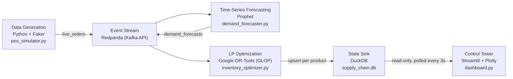

# Global Freight Network Optimization & SLA Penalty Mitigation

**A local, event-driven Control Tower that replaces static reorder points with a live forecasting-and-optimization loop — turning stockout risk into a priced, minimized, continuously-visible line item.**


-4285F4?logo=google&logoColor=white)


## Table of Contents

- [The Corporate Problem](#the-corporate-problem)
- [The Deliverable](#the-deliverable)
- [The Architecture (How It Works)](#the-architecture-how-it-works)
- [The Mathematical Engine](#the-mathematical-engine)
- [Local Hardware Optimization](#local-hardware-optimization)
- [Engineering Rigor](#engineering-rigor)
- [Project Structure](#project-structure)
- [How to Run](#how-to-run)

---

## The Corporate Problem

Most inventory systems in production today are still driven by **static reorder points**: fixed thresholds — "reorder 500 units when stock drops below 200" — set once, by hand, from historical averages. This works exactly until reality stops looking like the historical average, which in freight and retail networks is most of the time.

Static reorder points fail along three axes simultaneously:

1. **They don't see demand shift until it's already a problem.** A threshold set from last quarter's averages has no mechanism to detect a demand ramp *before* it causes a shortfall — by the time the reorder point fires, the network is already behind.
2. **They are blind to capacity.** A reorder point says "order more" — it has no concept of whether the factory can actually *produce* more that day. When forecasted demand exceeds daily production capacity, a static system doesn't degrade gracefully; it simply fails to deliver, with no visibility into how much, or what it costs.
3. **They don't price the failure.** A stockout isn't a binary event — it's a dollar figure, typically an SLA penalty clause with real financial teeth. Static systems don't weigh "hold more inventory" against "risk a penalty" as a cost trade-off, because they were never built to see either cost.

In this project's reference cost model, a single day where demand outpaces the 150-unit production ceiling by just 50 units generates **$5,000 in SLA penalties** on top of full production spend — invisible to a threshold-based system until the invoice arrives.

## The Deliverable

This repository is a fully event-driven, self-hosted **Supply Chain Control Tower**: a closed loop that generates live order data, forecasts demand per product on a rolling basis, re-solves a cost-minimizing production plan every time the forecast updates, and surfaces the result — including any SLA exposure — on a live dashboard that refreshes every three seconds.

It is built on the same architectural pattern a global freight network would run at scale — durable event streaming, statistical forecasting, linear-programming optimization, and a queryable state store feeding a real-time control surface — demonstrated here end-to-end against a local multi-product simulation, so every stage of the loop can be inspected, re-run, and reasoned about directly.

No cron jobs. No nightly batch reconciliation. No spreadsheet reorder points. Every new unit of demand data works its way through forecasting and optimization automatically, and the production schedule on screen is never more than a few seconds stale.

## The Architecture (How It Works)



| Stage | Technology | Script | Role |
|---|---|---|---|
| Data Generation | Python + Faker | `pos_simulator.py` | Emits synthetic POS orders (product, quantity, store, timestamp) every 0.2–1.5s onto `live_orders` |
| Event Stream | Redpanda (Kafka API, ARM64-native) | `docker-compose.yml` | Durable, ordered event backbone — the sole coupling point between every other stage |
| Time-Series Forecasting | Prophet | `demand_forecaster.py` | Maintains a rolling per-product time-bucketed history; every 75 orders, fits a fresh 7-day-ahead forecast per product and publishes it to `demand_forecasts` |
| LP Optimization | Google OR-Tools (GLOP) | `inventory_optimizer.py` | On every new forecast, re-solves the cost-minimizing 7-day production/inventory/stockout plan for that product |
| State Sink | DuckDB | `inventory_optimizer.py` → `supply_chain.db` | Embedded, file-based OLAP store — always holds exactly the latest 7-day outlook per product |
| Control Tower | Streamlit + Plotly | `dashboard.py` | Polls DuckDB every 3 seconds, renders KPIs, an SLA-aware production chart, and the raw schedule |

Each stage is an independent OS process communicating only through Kafka topics or the DuckDB file — there is no shared in-memory state anywhere in the system. Kill and restart any single stage and the rest of the pipeline keeps running, catching the restarted stage back up from durable state.

## The Mathematical Engine

At the core of `inventory_optimizer.py` is a linear program, re-solved from scratch every time a fresh 7-day forecast arrives. For each day *t* in the horizon, the solver chooses production, ending inventory, and — critically — unmet demand:

**Decision variables**

| Variable | Meaning | Bounds |
|---|---|---|
| `P_t` | Units produced on day *t* | `[0, 150]` — the factory's hard daily capacity |
| `I_t` | Ending inventory on day *t* | `[0, 5000]` — the warehouse's hard capacity |
| `S_t` | **Slack variable** — unmet demand / stockout volume | `[0, ∞)` |

**Balance constraint** (chained from `I_{-1} := 100`, the starting inventory):

```
I_t - S_t = I_{t-1} + P_t - Demand_t
```

**Objective — minimize total cost across the horizon:**

```
Minimize:  Σ ( 10.00 × P_t  +  1.50 × I_t  +  100.00 × S_t )
           production        holding        SLA penalty
```

### The slack variable is the release valve, not an afterthought

Before this constraint existed, production was unbounded — the model could always manufacture its way out of any demand spike, so it was never actually *at risk* of failure. Introducing a hard 150-unit daily ceiling changes that: a day whose demand exceeds `I_{t-1} + 150` has no way to balance the equation without `I_t` going negative, which its own `[0, 5000]` bound forbids outright. Without `S_t`, that isn't a bad solution — it's **no solution**. The solver returns `INFEASIBLE` and the pipeline stops producing a plan at exactly the moment a plan is most needed.

`S_t` absorbs that shortfall directly, so the model always has an answer — it just prices the shortfall at $100/unit instead of pretending it can't happen. Because that penalty is 10× the marginal cost of a unit of production, GLOP's optimal solution never lets `S_t` go positive while spare production capacity remains; a stockout only appears in the solution once `P_t` is already pinned at its ceiling. The slack variable converts a hard infeasibility into a *soft, quantified, minimized* business cost — which is precisely what turns this from a feasibility calculator into an SLA mitigation engine.

### Emergent behavior: the solver plans ahead of spikes it hasn't seen yet

Because the LP optimizes across the full 7-day window simultaneously rather than day-by-day, it discovers strategies a reactive, threshold-based system structurally cannot. Consider a two-day case: negligible demand (10 units) on day one, a 300-unit spike on day two, zero starting inventory.

A **reactive system** — one that produces only to cover the day's own known demand — produces 10 units on day one, then hits the 150-unit ceiling on day two, eating a 150-unit stockout: **$15,000 in penalties, $16,600 total cost.**

The **LP sees both days at once.** It recognizes that producing at full capacity on day one — 150 units, even though day one only needs 10 — banks 140 units of inventory at a marginal $1.50/day holding cost, which combines with day two's own full-capacity production to absorb almost the entire spike:

| | Day 1 Production | Day 1 Ending Inventory | Day 2 Production | Day 2 Stockout | **Total Cost** |
|---|---|---|---|---|---|
| Reactive (JIT) | 10 | 0 | 150 | 150 | **$16,600** |
| LP-Optimized | 150 | 140 | 150 | **10** | **$4,210** |

With zero starting inventory and a 150-unit daily ceiling, two days can deliver at most 290 units net of day one's own 10-unit demand — a 300-unit spike cannot be fully absorbed no matter how production is spread. The LP finds that mathematical floor exactly: **it cuts the stockout from 150 units to the true unavoidable minimum of 10 (a 93.3% reduction) and total cost by 74.6%** — achieved without changing a single cost constant, purely by planning two days ahead instead of one. This behavior was not hand-coded; it is the emergent result of handing the solver the full horizon at once. (Both rows above are validated, reproducible outputs of `solve_production_schedule()`, not illustrative estimates.)

## Local Hardware Optimization

This entire six-stage pipeline — a Kafka-API streaming broker, a Python ML forecasting service, an LP solver, an embedded analytical database, and a live web dashboard — runs on a single machine with no cloud dependency, no managed service bill, and no cross-network hop between stages:

- **Redpanda, not Apache Kafka.** Redpanda reimplements the Kafka protocol in C++ on the Seastar framework — no JVM, no garbage collector, no ZooKeeper/KRaft cluster coordination overhead. `docker-compose.yml` pins `platform: linux/arm64` and uses Redpanda's `--mode dev-container` flag, so on Apple Silicon the broker runs as a **native ARM64 binary**, not under QEMU translation — the single biggest source of "why is my local Kafka slow" on M-series hardware.
- **DuckDB is out-of-core by design.** It's an embedded, columnar, vectorized query engine that runs in-process — no separate database server, no connection pool, no network round-trip for a query the dashboard issues every 3 seconds. Its vectorized execution model is built to process data larger than available RAM by spilling efficiently to disk, rather than requiring everything to fit in memory at once — a genuine advantage as the state sink scales past a laptop's working set.
- **Unified memory, not cross-process copying.** On Apple Silicon, CPU, GPU, and Neural Engine share one physical memory pool at high bandwidth. In practice, that means Redpanda's event buffers, Prophet's forecasting workload, OR-Tools' solver, and DuckDB's columnar store are all contending for and benefiting from the *same* memory system rather than shuttling data across a network fabric between isolated cloud instances — the entire loop, from a POS event landing to a re-optimized schedule appearing on the dashboard, happens without a single cross-machine network call.

The result: a complex microservices architecture that would typically require a managed Kafka cluster, a hosted Postgres/warehouse instance, and a provisioned compute tier for the ML/OR workloads — reproduced here as five `python` processes and one Docker container, with zero cloud infrastructure cost.

## Engineering Rigor

Every cost figure and architectural claim in this README is backed by validation performed against the actual code, not assumed from documentation:

- **The LP is validated against hand-computed optima**, not just "does it run" — the JIT baseline ($2,575 on constant demand), the capacity-bound stockout case ($6,500), and the pre-build-ahead-of-spike case ($4,210) were all independently derived by hand and matched to the solver's output to the cent.
- **DuckDB's multi-process read/write semantics were verified empirically, not assumed** — a real, separate OS process holding a long-lived read-only connection was confirmed to *never* see a second process's committed writes without reconnecting. That single finding is why `dashboard.py` opens a fresh connection on every poll instead of caching one — the more "obvious" design would have silently frozen the Control Tower on stale data.
- **Schema evolution is migration-safe.** `write_schedule_to_duckdb()` was tested against a simulated pre-upgrade database (missing the `stockout`/`sla_penalty_cost` columns added for the SLA engine) to confirm `ALTER TABLE ... ADD COLUMN IF NOT EXISTS` backfills cleanly with zero downtime and zero data loss.
- **Two real upstream library defects were caught and patched**, not worked around blindly: `kafka-python` 3.x's built-in `JsonSerializer` silently returns `None` on both serialize and deserialize (replaced with a 4-line custom class), and its exception hierarchy no longer exposes `NoBrokersAvailable` (replaced with the correct `KafkaTimeoutError`/`KafkaError` chain).

## Project Structure

```
.
├── docker-compose.yml     # Single-node Redpanda broker, ARM64-native
├── pos_simulator.py       # Stage 1: synthetic POS event generator
├── demand_forecaster.py   # Stage 2/3: rolling aggregation + Prophet forecasting
├── inventory_optimizer.py # Stage 4/5: GLOP linear program + DuckDB sink
├── dashboard.py           # Stage 6: Streamlit Control Tower
├── requirements.txt       # Python dependencies for all four services
└── README.md
```

## How to Run

**Prerequisites:** Docker Desktop (or OrbStack/Colima) with ARM64 support, Python 3.11+, and a C++ toolchain (Xcode Command Line Tools on macOS) for Prophet's Stan backend.

```bash
# 1. Create and activate a virtual environment
python3 -m venv .venv
source .venv/bin/activate

# 2. Install dependencies
pip install -r requirements.txt

# 3. One-time: install Prophet's CmdStan backend (~2-5 min, downloads + compiles)
python -m cmdstanpy.install_cmdstan

# 4. Start the event streaming backbone
docker compose up -d
docker compose ps   # wait for "healthy"
```

With the broker running, launch each stage of the pipeline in its **own terminal** (all four must run concurrently — this is a live, event-driven system, not a batch script):

```bash
# Terminal 1 — generates live order events
source .venv/bin/activate && python3 pos_simulator.py

# Terminal 2 — forecasts demand and publishes 7-day outlooks
source .venv/bin/activate && python3 demand_forecaster.py

# Terminal 3 — solves the LP and writes schedules to DuckDB
source .venv/bin/activate && python3 inventory_optimizer.py

# Terminal 4 — the live Control Tower
source .venv/bin/activate && streamlit run dashboard.py
```

The dashboard populates as soon as `inventory_optimizer.py` writes its first schedule — typically within the first minute, once `demand_forecaster.py` has accumulated enough order volume to fit an initial forecast. Stop any stage with `Ctrl+C`; each one shuts down cleanly, flushing and closing its Kafka connections before exiting.
